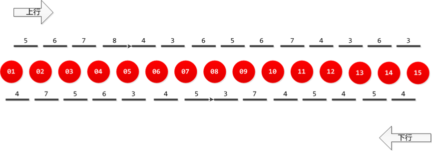
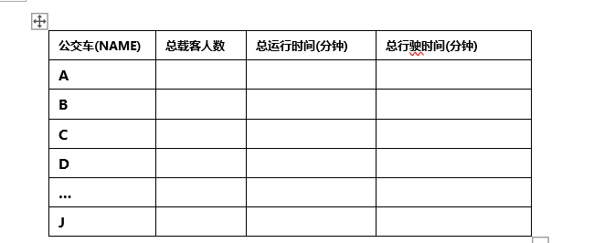
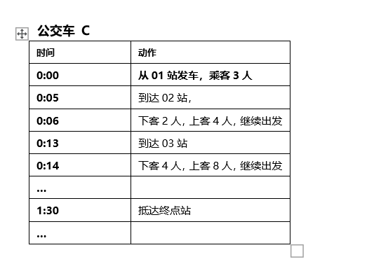

## 电车

瞎写写别人发的面试题应该是万达的

应该是和电梯调度算法差不多意思

一条公交线路，有15个站点，每个站点之间的运行时间不一，相同2个站点之间上行和下行时间也不一样 具体见下图。

共有10辆电动公交车，分别从两个终点站开始运行。起始时刻，每边各5辆公交车，每隔15分钟发出一辆。具体情况如下（完成）

1. 每辆公交车有司机1名，无售票员，最多载乘客29人。公交车到终点站时，如果还有乘客，则车上的乘客必须全部下车。（完成）
2. 站点之间的行驶时间是参考时间，实际根据路况，会有随机0到1分钟的误差，在本题中，可以随机确定,精确到分钟（完成）
3. 公交车到终点站后，完成乘客下车和上车后（乘客下车和上车时间按照第4节说明），立即向另一个终点站行驶。（完成）
4. 每5分钟会有10名乘客，每个乘客所在站点和目标站点是随机确定的，乘客在站点等待乘坐公交车去往目标站点（举例：乘客P1出现在站点08，目标站点04。等待公交车到08站点后乘车到04站点）。公交车到站时,
   乘客先下后上，每个乘客下车或者上车时间均为10秒。上车的乘客去往目标站点的方向要与公交车行驶方向一致。（完成）
5.
公交车有比较小的几率会出现故障（本题目设定故障几率：十分之一），简化起见，假定公交车发生故障时都是在到站后，路上行驶中不会发生故障。当公交车发生故障时，车上的乘客都下车，等待下一辆公交车到来。当下一辆公交车到达时，优先保障故障车下来的乘客先上车，如果车满没有办法全部上车，则顺次等待下一辆公交车到来按照相同规则进行。（困难）
6. 每辆电动公交车行驶时是匀速行驶。

编程要求：

1. 使用面向对象的方法进行编程，可以根据自己偏好自由选择C、C#、C++、Java、Delphi、OC中的任意一种语言。
2. 请初始时刻模拟300分钟期间公交车的运行状态。
3. 输出每辆公交车的运行状况，格式如下。

4. 输出任意2量公交车的运行明细，格式如下。

其他要求：

1. 提交物包括：完整项目源程序和已经编译好的可执行程序，并分别按照\src,\bin三个目录分别存放好。
2. 可以网上查询相关技术资料，但要确保独立完成，不得互相抄袭代码。
3. 代码实现要考虑到扩展性。要在公交车的数量，站点数量，站点间运行时间等发生变化时，代码能够很容易地扩展和支持。

评分要点及检查项:

1. 编码规范，函数及类命名合理准确，无歧义。合理正确的使用面向对象的方法进行程序结构设计。程序的关键实现部分要进行注释说明，无内存等资源泄露。程序源码可以编译通过，无错误及警告提示。
2. 能够完整通过多线程模拟运行过程，线程使用安全及运用合理，无死锁等现象发生。
3. 比赛结果逻辑正确。
4. 程序没有固定最优答案，根据实际运行结果综合评分。请同学做好系统分析，并充分发挥自己的想象力和创造力。
